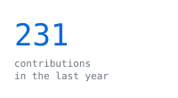
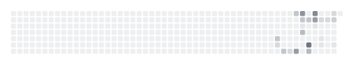
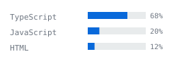
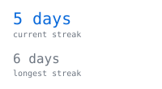

  

<table style="border: none; border-collapse: collapse;">
  <tr>
    <td style="border: none; width: 320px; padding: 0; text-align: center;">
      
    </td>
    <td style="border: none; width: 260px; padding: 0; text-align: center;">
      
    </td>
  </tr>
  <tr>
    <td style="border: none; width: 320px; padding: 0; text-align: center;">
      
    </td>
    <td style="border: none; width: 260px; padding: 0; text-align: center;">
      
    </td>
  </tr>
</table>

<h1 align="center">Hi, I'm Chrisanto Domingo Jr. 👋</h1>

  <b>Computer Science Student @ University of the Philippines Diliman</b>
   
  Building full-stack products end to end.

  
  
  

---

## About Me

I'm a Computer Science student at the **University of the Philippines Diliman** (BS CS, Aug. 2025 – Present), focused on **full-stack web development, real-time systems, and AI-assisted engineering**.

I like shipping things people actually use — my projects run in production, are used by 100+ students, and live at custom domains, not just sitting in a repo.

### Current Focus

- Real-time and event-driven systems (Supabase Realtime, WebSockets)
- REST API design and backend architecture (Express, FastAPI)
- AI-assisted software development workflows
- Preparing for software engineering internships

---

# Featured Projects

## 📡 [CRS Monitor](https://github.com/cedomingo/CRS-Monitor) · [Live Demo](https://crs-monitor.onrender.com/)

A live monitor for UP Diliman's CRS enlistment system, polling all 26 lettered schedule pages during registration to detect newly-opened class sections in near real time.

- Resilient Cheerio-based HTML parser built to survive CRS's inconsistent markup (split class codes, multi-word subjects, decimal course numbers)
- REST API (Express) backed by SQLite, with a polling React frontend for live slot availability — no manual refreshing
- Deployed to Render with a persistent disk; used by **100+ university students** during registration

`Node.js` `Express` `React (Vite)` `SQLite` `Cheerio`

## 🎉 [Party Together](https://github.com/cedomingo/party-together) · [Live Demo](https://www.partytogether.online/)

A full multiplayer party-game platform on a custom domain — a host creates a room, shares a link, and friends join to play browser games together live.

- Real-time room/lobby infrastructure via Supabase Realtime + Anonymous Auth: short room codes, join by link/code, live presence, host controls, reconnect handling
- Full game logic (turns, guessing, scoring) for the platform's first game, "Who Am I?", on a game-agnostic core architecture
- Deployed on Vercel behind Cloudflare

`Next.js` `Supabase` `PostgreSQL` `Cloudflare` `Vercel`

## 🗓️ [Sabay Sablay](https://github.com/cedomingo/sabay-sablay) · [Live Demo](https://sabay-sablay.vercel.app/)

A schedule-visualizer web app: upload a screenshot of your class schedule, OCR it into structured data, and get a combined free/busy view for a group.

- Separate FastAPI OCR microservice integrated with the Next.js app via a shared-secret header, enriched with live data from CRS Monitor
- Group availability heatmap with a "best times to meet" callout, shared task boards, presence indicators, in-app notifications
- Google OAuth with row-level security

`Next.js` `TypeScript` `Tailwind` `Supabase` `FastAPI`

## 🏠 [My Dorm](https://github.com/cedomingo/my-dorm) · [Live Demo](https://cedomingo.github.io/my-dorm/)

An installable Android app for daily dorm life: budgeting, food/expense logging, task and exam deadlines, sleep and reading logs, and medication schedules — all persisted on-device.

- Native Android home-screen widget written in Java (`AppWidgetProvider` + `RemoteViewsService`), bridged to the React app via a custom Capacitor plugin, keeping "closest deadlines" in sync even when the app is closed
- On-device local push notifications (Capacitor Local Notifications) for payments, debts, deadlines, exams, and medicine

`React` `Capacitor` `Java (Android)` `Tailwind`

---

# Tech Stack

## Languages

## Frameworks & Libraries

## Databases & Platforms

## Tools & Concepts

REST API Design · OAuth · Web Scraping · Real-time Systems (WebSockets/Realtime)

---

# Education

**University of the Philippines Diliman** - Quezon City
BS Computer Science · Aug. 2025 – Present

---

# Certifications & Seminars

- **IBM SkillsBuild** - Artificial Intelligence Fundamentals, Build Your First Chatbot, Generative AI in Action
- **Google Cloud** - Introduction to Generative AI, Introduction to Large Language Models, Create Generative AI Applications
- **Microsoft & LinkedIn Learning** - Career Essentials in Generative AI
- **GDG Cloud Manila Seminar** (June 2026) - Build with AI: The Future of AI & Research
- **Stack Up Seminar** (June 2026) - Build the AI-Powered World Before It Builds Without You

---

# Goals for 2026

- Ship another production project used by real students
- Deepen backend & real-time systems fundamentals
- Contribute to open-source projects
- Secure a software engineering internship

---

# Connect with Me

📧 **[chrisantodomjr@gmail.com](mailto:chrisantodomjr@gmail.com)**
💼 **[linkedin.com/in/chrisanto-domingo](https://www.linkedin.com/in/chrisanto-domingo-9898b3375)**
💻 **[github.com/cedomingo](https://github.com/cedomingo)**

---

  <i>"The best way to learn software engineering is by building software."</i>

<!--
  How this page draws itself — see PIPELINE.md for the full writeup:
  - first.svg is the typing ASCII portrait (make_ascii_svg.py)
  - stats.svg / streak.svg / langs.svg / year.svg are regenerated nightly
    by .github/workflows/refresh-stats.yml running scripts/generate_stats.py
  - everything is stdlib Python + inline SVG/SMIL, zero third-party requests
-->